# Every case, rerun

Generated by `examples/third-party/demo.py` from the files in this repository. Each
case was first captured where its line says (live cases on GitHub-hosted runners;
see `THIRD-PARTY.md`). Here each sample is scored again, and where a case has a
second file with records removed, cut or resealed, the table shows whether the
score noticed. **Same result** means the removal is invisible to a reader holding
only that file; **caught** means a check that passed now fails.

Rerun it yourself: `python3 examples/third-party/demo.py`

## agentgateway 1.5.0

*one live run on a GitHub-hosted runner, 2026-09-29*. Pair: the refused tool call removed.


| file | structural | attested | failed requirements | compared with the first row |
|---|---|---|---|---|
| as captured | L0 | L0 | 12 | — |
| refused call removed | L0 | L0 | 12 | **same result** |

```sh
python3 conformance.py --log examples/third-party/agentgateway-live-full.jsonl --adapter adapters/agentgateway-live.json
python3 conformance.py --log examples/third-party/agentgateway-live-scrubbed.jsonl --adapter adapters/agentgateway-live.json
```

## Docker MCP Gateway v0.44.1

*one live run, 2026-09-29*. Pair: the refused calls removed.


| file | structural | attested | failed requirements | compared with the first row |
|---|---|---|---|---|
| as captured | L0 | L0 | 12 | — |
| refused calls removed | L0 | L0 | 12 | **same result** |

```sh
python3 conformance.py --log examples/third-party/docker-mcp-live-full.jsonl --adapter adapters/docker-mcp-live.json
python3 conformance.py --log examples/third-party/docker-mcp-live-scrubbed.jsonl --adapter adapters/docker-mcp-live.json
```

## IBM ContextForge 1.0.11

*one live run, 2026-09-29*. Pair: the refused calls removed.


| file | structural | attested | failed requirements | compared with the first row |
|---|---|---|---|---|
| as captured | L0 | L0 | 12 | — |
| refused calls removed | L0 | L0 | 12 | **same result** |

```sh
python3 conformance.py --log examples/third-party/contextforge-live-full.jsonl --adapter adapters/contextforge-live.json
python3 conformance.py --log examples/third-party/contextforge-live-scrubbed.jsonl --adapter adapters/contextforge-live.json
```

## Lasso MCP Gateway 1.2.1

*one live run, 2026-09-29*. Pair: the refused call removed.


| file | structural | attested | failed requirements | compared with the first row |
|---|---|---|---|---|
| as captured | L0 | L0 | 13 | — |
| refused call removed | L0 | L0 | 13 | **same result** |

```sh
python3 conformance.py --log examples/third-party/lasso-live-full.jsonl --adapter adapters/lasso-live.json
python3 conformance.py --log examples/third-party/lasso-live-scrubbed.jsonl --adapter adapters/lasso-live.json
```

## Bifrost 2.2.3

*one live run, 2026-09-29*. Pair: the refused call removed.


| file | structural | attested | failed requirements | compared with the first row |
|---|---|---|---|---|
| as captured | L0 | L0 | 13 | — |
| refused call removed | L0 | L0 | 13 | **same result** |

```sh
python3 conformance.py --log examples/third-party/bifrost-live-full.jsonl --adapter adapters/bifrost-live.json
python3 conformance.py --log examples/third-party/bifrost-live-scrubbed.jsonl --adapter adapters/bifrost-live.json
```

## NVIDIA OpenShell 0.1.2

*one live run, one driver, 2026-09-29*. Pair: the six DENIED lines removed.


| file | structural | attested | failed requirements | compared with the first row |
|---|---|---|---|---|
| as captured | L0 | L0 | 12 | — |
| DENIED lines removed | L0 | L0 | 12 | **same result** |

```sh
python3 conformance.py --log examples/third-party/openshell-live-full.jsonl --adapter adapters/nvidia-openshell-live.json
python3 conformance.py --log examples/third-party/openshell-live-scrubbed.jsonl --adapter adapters/nvidia-openshell-live.json
```

## OpenAI Agents SDK 0.22.3

*one live run, mock model endpoint, 2026-09-30*. Pair: the guardrail-refused call removed, and 25 of 29 items dropped by a full queue.


| file | structural | attested | failed requirements | compared with the first row |
|---|---|---|---|---|
| as captured | L0 | L0 | 13 | — |
| refused call removed | L0 | L0 | 13 | **same result** |
| queue overflow, 25 of 29 dropped | L0 | L0 | 13 | **same result** |

```sh
python3 conformance.py --log examples/third-party/openai-agents-live-full.jsonl --adapter adapters/openai-agents-live.json
python3 conformance.py --log examples/third-party/openai-agents-live-scrubbed.jsonl --adapter adapters/openai-agents-live.json
python3 conformance.py --log examples/third-party/openai-agents-live-overflow.jsonl --adapter adapters/openai-agents-live.json
```

## OpenTelemetry GenAI spans

*one live run, mock model endpoint, 2026-09-30*. Pair: the refused call removed.


| file | structural | attested | failed requirements | compared with the first row |
|---|---|---|---|---|
| as captured | L0 | L0 | 13 | — |
| refused call removed | L0 | L0 | 13 | **same result** |

```sh
python3 conformance.py --log examples/third-party/otel-genai-live-full.jsonl --adapter adapters/otel-genai-live.json
python3 conformance.py --log examples/third-party/otel-genai-live-scrubbed.jsonl --adapter adapters/otel-genai-live.json
```

## Falco 0.45.0

*one live run per configuration, 2026-09-30*. Pair: a rule alert removed, and the default configuration that dropped 11694 syscalls with no drop alert.


| file | structural | attested | failed requirements | compared with the first row |
|---|---|---|---|---|
| tuned, as captured | L0 | L0 | 12 | — |
| rule alert removed | L0 | L0 | 12 | **same result** |
| default configuration | L0 | L0 | 12 | **same result** |

```sh
python3 conformance.py --log examples/third-party/falco-live-full.jsonl --adapter adapters/falco-live.json
python3 conformance.py --log examples/third-party/falco-live-scrubbed.jsonl --adapter adapters/falco-live.json
python3 conformance.py --log examples/third-party/falco-live-default.jsonl --adapter adapters/falco-live.json
```

## Trillian Tessera v1.0.4 (positive control)

*one live run, 2026-09-30*. Pair: one entry removed; then the full log against held checkpoints.


| file | structural | attested | failed requirements | compared with the first row |
|---|---|---|---|---|
| as captured | L1 | L1 | 10 | — |
| one entry removed | L0 | L0 | 10 | **caught**: VLC-L1-1 PASS→FAIL, VLC-L2-1 PASS→FAIL (and 8 later checks no longer reached) |
| full, against held size-3 and size-6 checkpoints | L1 | L1 | 10 | **same result** |

```sh
python3 conformance.py --log examples/third-party/tessera-live-full.jsonl --adapter adapters/tessera-live.json
python3 conformance.py --log examples/third-party/tessera-live-scrubbed.jsonl --adapter adapters/tessera-live.json
python3 conformance.py --log examples/third-party/tessera-live-full.jsonl --adapter adapters/tessera-live.json --expect-root d1d2ed1574b7… --expect-head 8082a0520690…
```

## invinoveritas verdict ledger (positive control)

*public API and Nostr relays, 2026-09-30*. Pair: the newest entry dropped, on the log alone and against the signed Nostr head.


| file | structural | attested | failed requirements | compared with the first row |
|---|---|---|---|---|
| log alone | L0 | L0 | 11 | — |
| newest entry dropped, log alone | L0 | L0 | 11 | **same result** |
| against the signed head | L1 | L1 | 10 | VLC-L1-3 FAIL→PASS |
| newest entry dropped, against the signed head | L0 | L0 | 12 | **caught**: VLC-L1-1 PASS→FAIL (and 2 later checks no longer reached) |

```sh
python3 conformance.py --log examples/third-party/invinoveritas-ledger-live-full.jsonl --adapter adapters/invinoveritas-ledger-live.json
python3 conformance.py --log examples/third-party/invinoveritas-ledger-live-truncated.jsonl --adapter adapters/invinoveritas-ledger-live.json
python3 conformance.py --log examples/third-party/invinoveritas-ledger-live-full.jsonl --adapter adapters/invinoveritas-ledger-live.json --expect-head 04467b72e323…
python3 conformance.py --log examples/third-party/invinoveritas-ledger-live-truncated.jsonl --adapter adapters/invinoveritas-ledger-live.json --expect-head 04467b72e323…
```

## JIDEC ledger, n 65 export (scored by its operator)

*live export, 2026-09-30*. Pair: the same export cut at n 64 and resealed consistently, against the Bitcoin-stamped n 65 head.


| file | structural | attested | failed requirements | compared with the first row |
|---|---|---|---|---|
| log alone | L1 | L1 | 10 | — |
| against the n 65 stamp | L1 | L1 | 10 | **same result** |
| cut at n 64 and resealed, log alone | L1 | L1 | 10 | **same result** |
| cut at n 64 and resealed, against the n 65 stamp | L0 | L0 | 11 | **caught**: VLC-L1-1 PASS→FAIL (and 2 later checks no longer reached) |

```sh
python3 conformance.py --log examples/third-party/jidec-ledger-chained-n65.jsonl --adapter adapters/jidec-ledger-chained.json
python3 conformance.py --log examples/third-party/jidec-ledger-chained-n65.jsonl --adapter adapters/jidec-ledger-chained.json --expect-head 13d1a8dad24d…
python3 conformance.py --log examples/third-party/jidec-ledger-chained-n65-resealed-64.jsonl --adapter adapters/jidec-ledger-chained.json
python3 conformance.py --log examples/third-party/jidec-ledger-chained-n65-resealed-64.jsonl --adapter adapters/jidec-ledger-chained.json --expect-head 13d1a8dad24d…
```

## MCP tool calls (from public documentation)

*synthetic, shape-accurate*. Pair: the same session recorded by a host connected to one server.


| file | structural | attested | failed requirements | compared with the first row |
|---|---|---|---|---|
| full session | L0 | L0 | 13 | — |
| partial host | L0 | L0 | 13 | **same result** |

```sh
python3 conformance.py --log examples/third-party/mcp-toolcall.jsonl --adapter adapters/mcp-toolcall.json
python3 conformance.py --log examples/third-party/mcp-toolcall-partial-host.jsonl --adapter adapters/mcp-toolcall.json
```

## Fab equipment, SECS-II/GEM (from public documentation)

*synthetic, shape-accurate*. Pair: the same excursion under a sparse sampling plan.


| file | structural | attested | failed requirements | compared with the first row |
|---|---|---|---|---|
| full trace | L0 | L0 | 13 | — |
| sampled trace | L0 | L0 | 13 | **same result** |

```sh
python3 conformance.py --log examples/third-party/fab-equipment-full.jsonl --adapter adapters/fab-equipment-secsgem.json
python3 conformance.py --log examples/third-party/fab-equipment-sampled.jsonl --adapter adapters/fab-equipment-secsgem.json
```

## OpenTelemetry OTLP logs (from public documentation)

*synthetic, shape-accurate*.


| file | structural | attested | failed requirements | compared with the first row |
|---|---|---|---|---|
| sample | L0 | L0 | 13 | — |

```sh
python3 conformance.py --log examples/third-party/otlp-logs.jsonl --adapter adapters/otel-otlp-logs.json
```

## Kubernetes audit (from public documentation)

*synthetic, shape-accurate*.


| file | structural | attested | failed requirements | compared with the first row |
|---|---|---|---|---|
| sample | L0 | L0 | 12 | — |

```sh
python3 conformance.py --log examples/third-party/k8s-audit.jsonl --adapter adapters/k8s-audit.json
```

## Linux auditd (from public documentation)

*synthetic, shape-accurate*.


| file | structural | attested | failed requirements | compared with the first row |
|---|---|---|---|---|
| sample | L0 | L0 | 12 | — |

```sh
python3 conformance.py --log examples/third-party/linux-auditd.jsonl --adapter adapters/linux-auditd.json
```

## AWS CloudTrail digests (from public documentation)

*synthetic, shape-accurate*.


| file | structural | attested | failed requirements | compared with the first row |
|---|---|---|---|---|
| sample | L0 | L0 | 10 | — |

```sh
python3 conformance.py --log examples/third-party/cloudtrail-digests.jsonl --adapter adapters/aws-cloudtrail-digest.json
```

## AER-1, IETF agent-receipt draft


*Not a log: the draft's own reference verifier, run against the VLC-1 tamper cases
(`aer1-07/chain_attacks.py`). The kit is not in this repository, so this section
shows the saved output from each kit commit tested.* Details: `THIRD-PARTY.md`,
*Cross-testing another draft's chain: AER-1*.

- kit `aff1330 (draft -07)`: 26 of 30 as expected; 4 gap(s) ([output](aer1-07/results-kit-aff1330.txt))
- kit `e1430ec (draft -08)`: 26 of 30 as expected; 4 gap(s) ([output](aer1-07/results-kit-e1430ec.txt))
- kit `4edbcbb (fixes in)`: 27 of 30 as expected; 3 gap(s) ([output](aer1-07/results-kit-4edbcbb.txt))
